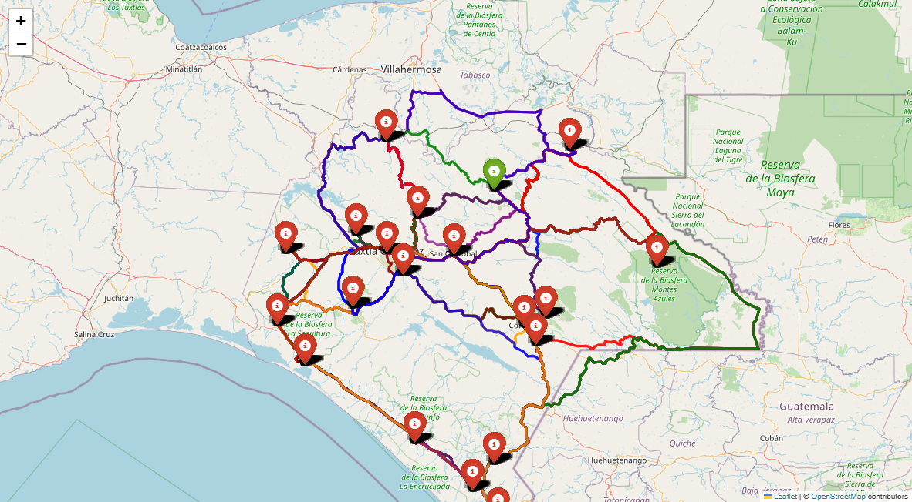

:::{style="text-align: justify"}

En situaciones de emergencia, como desastres naturales o crisis humanitarias, la eficiencia en la distribución de ayuda humanitaria constituye un factor determinante para la reducción del impacto sobre las poblaciones afectadas. En regiones caracterizadas por una topografía accidentada y una dispersión territorial significativa, como el estado de Chiapas, la planificación logística enfrenta desafíos estructurales que incrementan los tiempos de respuesta y los costos operativos de distribución.

HOLAA

El estado de Chiapas, conformado por 124 municipios según el Instituto Nacional de Estadística y Geografía (INEGI), presenta una configuración geográfica predominantemente montañosa, con elevaciones que oscilan entre el nivel del mar en la costa del Pacífico y los 4,097 metros sobre el nivel del mar en el Volcán Tacaná. Esta variabilidad altimétrica genera barreras naturales que fragmentan la red vial estatal, limitando particularmente el acceso a comunidades asentadas en laderas y mesetas de difícil conectividad.

Para abordar este problema de optimización logística, se propone la aplicación del algoritmo PageRank a la red territorial del estado. Originalmente desarrollado por Page y Brin (1998) para el ordenamiento de páginas web, este algoritmo fundamenta su operación en la teoría de cadenas de Markov de tiempo discreto, proporcionando una medida de centralidad que identifica nodos estratégicos dentro de una red compleja.

Matemáticamente, sea $G = (V, E, W)$ un grafo dirigido ponderado que representa la red territorial, donde $V$ denota el conjunto de vértices (municipios), $E \subseteq V \times V$ el conjunto de aristas (conexiones viales), y $W: E \to \mathbb{R}^+$ una función que asigna a cada arista $(v_i, v_j)$ la distancia tridimensional $d_{ij}^{(3D)}$ entre los municipios $i$ y $j$. El algoritmo PageRank calcula el vector estacionario $\pi \in \mathbb{R}^{124}$ que satisface:

$$
\pi = P\pi, \quad \sum_{i=1}^{124} \pi_i = 1, \quad \pi_i > 0 \; \forall i,
$$

donde $P$ es la matriz de transición modificada que incorpora un factor de amortiguamiento $p = 0.85$ para garantizar la ergodicidad de la cadena. El valor $\pi_i$ representa la importancia relativa del municipio $i$ dentro de la red, permitiendo identificar aquellos nodos que actúan como centros de distribución naturales.

El flujo metodológico desarrollado en este capítulo comprende las siguientes etapas:

1. Recolección de datos geoespaciales mediante la API de Open Source Routing Machine (OSRM) y el Modelo Digital de Elevación (DEM) de la misión SRTM de la NASA.
2. Cálculo de distancias tridimensionales que incorporan explícitamente las variaciones topográficas del terreno.
3. Construcción formal de la red territorial como grafo ponderado.
4. Aplicación del algoritmo PageRank y análisis de convergencia de la cadena de Markov subyacente.
5. Identificación de rutas óptimas desde el punto de almacenamiento (Protección Civil en Tuxtla Gutiérrez) hacia los municipios prioritarios. **DUDA: depende si se palica dijkstra**

Esta metodología proporciona una base matemáticamente rigurosa para la toma de decisiones en la planificación logística de emergencias, permitiendo optimizar la distribución de recursos mediante la identificación de puntos estratégicos dentro de la red territorial estatal.

## Contexto humanitario y desafíos logísticos en Chiapas

En situaciones de emergencia, como desastres naturales o crisis humanitarias, resulta fundamental contar con mecanismos eficientes para distribuir ayuda y recursos a la población afectada. En regiones como el estado de Chiapas, que de acuerdo con el Instituto Nacional de Estadística y Geografía (INEGI) cuenta con 124 municipios, las condiciones geográficas montañosas y la dispersión territorial dificultan significativamente la conectividad y el acceso a comunidades vulnerables.

El estado de Chiapas presenta una configuración geográfica predominantemente montañosa, con elevaciones que oscilan entre el nivel del mar en la costa del Pacífico y los 4,097 metros sobre el nivel del mar en el Volcán Tacaná. Esta variabilidad altimétrica genera barreras naturales que fragmentan la red vial estatal, limitando particularmente el acceso a comunidades asentadas en laderas y mesetas de difícil conectividad.

La infraestructura vial del estado presenta limitaciones estructurales que se acentúan durante eventos críticos. Las carreteras principales siguen valles y corredores fluviales, dejando aisladas comunidades asentadas en zonas de difícil acceso. Adicionalmente, fenómenos como deslaves, inundaciones y daños en puentes interrumpen frecuentemente las rutas de acceso durante temporadas de lluvias. Estas condiciones incrementan los tiempos de respuesta y los costos operativos de distribución, haciendo necesario identificar puntos estratégicos dentro de la red territorial que faciliten la logística y permitan una respuesta rápida y efectiva ante situaciones críticas.

Para abordar este desafío, se propone aplicar el algoritmo PageRank, desarrollado originalmente por Larry Page y Sergey Brin como parte del motor de búsqueda de Google, con el propósito de priorizar municipios de acuerdo con su importancia dentro de la red de transporte intermunicipal. Este algoritmo, fundamentado en un modelo de cadenas de Markov, mide la relevancia de cada nodo (municipio) mediante la simulación de un navegante aleatorio que recorre la red con cierta probabilidad de seguir los enlaces existentes o de saltar de manera aleatoria hacia otro nodo.

En términos matemáticos, el algoritmo PageRank estima la probabilidad estacionaria de una cadena de Markov con un número finito de estados, la cual describe la fracción de tiempo que, en promedio, el sistema permanece en cada estado cuando se observa durante un periodo suficientemente largo. Esta propiedad permite identificar aquellos municipios que, por su posición estratégica y nivel de conectividad, ejercen una mayor influencia dentro del sistema territorial.

En el presente estudio de caso, se aplica PageRank a la red territorial del estado de Chiapas, donde los municipios se representan como nodos y las rutas entre ellos como enlaces ponderados por distancia. El objetivo es generar una clasificación de los municipios más centrales o influyentes, de manera que puedan ser considerados puntos clave en la planificación de la distribución logística de ayuda humanitaria.

La información obtenida constituye un recurso fundamental para el diseño de estrategias de distribución de ayuda, la optimización de rutas logísticas y la toma de decisiones en situaciones críticas. La sección siguiente describe la metodología de recolección de datos geoespaciales utilizada para construir la red territorial del estado.

## Recolección de datos geoespaciales: OSRM y Modelo Digital de Elevación

El estudio utilizó dos fuentes principales de datos geoespaciales para construir la red territorial del estado de Chiapas.

### Fuentes de información

#### Datos de rutas viales

Los datos de conectividad entre municipios se obtuvieron mediante la API de *Open Source Routing Machine* (OSRM) (@osrm), la cual proporciona información detallada sobre las rutas existentes entre pares de coordenadas geográficas. El formato de los datos corresponde a coordenadas geográficas en el sistema WGS84 (`[latitud, longitud]`) para cada punto que conforma la trayectoria vial entre municipios.

#### Datos de elevación topográfica

La información altimétrica proviene del *Modelo Digital de Elevación* (DEM) generado por la misión *Shuttle Radar Topography Mission* (SRTM) de la NASA, disponible en NASA Earthdata (@nasa_earthdata). Los datos presentan una resolución espacial de 30 metros y se distribuyen en teselas de $1^\circ \times 1^\circ$ de latitud y longitud. Cada archivo ráster SRTM consiste en una malla regular de celdas (píxeles), donde cada celda almacena un valor de elevación del terreno expresado en metros sobre el nivel del mar (m s. n. m.).

Para cubrir áreas extensas, como un estado o una región montañosa, se integran múltiples teselas, generando un **mosaico ráster** continuo y sin discontinuidades, que permite representar de manera uniforme el relieve del terreno.

### Procedimiento de integración de datos

El proceso de recolección y procesamiento de datos se implementó mediante el siguiente flujo de trabajo:

1. **Carga y fusión de teselas DEM**: Se integraron 12 teselas SRTM adyacentes que cubren completamente el territorio del estado de Chiapas, generando un mosaico ráster continuo.

2. **Obtención de coordenadas geográficas**: Para cada municipio, se consultaron sus coordenadas geográficas mediante el servicio de geocodificación Nominatim de OpenStreetMap (@nominatim).

3. **Consulta de rutas viales**: Utilizando la API de OSRM, se obtuvieron las rutas óptimas entre cada par de municipios, incluyendo la secuencia de coordenadas que conforman cada trayectoria.

4. **Extracción de elevaciones**: Para cada punto de coordenadas en las rutas viales, se interpoló su elevación a partir del mosaico ráster SRTM.

5. **Cálculo de distancias**: Se calcularon tanto las distancias geodésicas 2D como las distancias tridimensionales 3D incorporando las variaciones topográficas.

### Lista de municipios analizados

El estudio consideró la totalidad de los 124 municipios que conforman el estado de Chiapas, de acuerdo con el Instituto Nacional de Estadística y Geografía (INEGI). La lista completa de municipios se presenta en el **Apéndice A** (@sec-apendice-municipios) de esta tesis.

### Implementación computacional

El código completo para la extracción y procesamiento de los datos garantiza la transparencia y reproducibilidad del estudio. Las funciones principales implementadas incluyen:

- `cargar_mosaico_srtm()`: Carga y fusiona múltiples teselas DEM en un único mosaico ráster.
- `obtener_coordenadas(ciudad)`: Obtiene las coordenadas geográficas de un municipio mediante Nominatim.
- `obtener_ruta_osrm(coord_origen, coord_destino)`: Consulta la ruta óptima entre dos puntos usando la API de OSRM.
- `calcular_distancia_3d_ruta(mosaico, transform, ruta_coords)`: Calcula la distancia 3D incorporando variaciones topográficas.

El código completo se presenta en el **Apéndice A** de esta tesis.

### Resultados de la recolección de datos

Con los datos obtenidos y procesados, se generó un conjunto de información que incluye para cada par de municipios:

- **Distancia carretera**: Longitud de la ruta vial según OSRM (en km).
- **Distancia 3D**: Longitud incorporando variaciones topográficas (en km).
- **Diferencia**: Incremento por efecto del relieve (en km).
- **Tiempo estimado**: Duración del recorrido (en minutos).

::: {.content-visible when-format="html"}
::: {#fig-mapa-rutas}
<iframe src="mapa_rutas_chiapas_completo.html" width="100%" height="600px" frameborder="0"></iframe>
:::
:::

::: {.content-visible when-format="pdf"}
{#fig-mapa width=90% fig-align="center"}
:::

::: {.content-visible when-format="pdf"}
La @fig-mapa muestra la red territorial resultante, donde se observa claramente cómo la topografía montañosa del estado genera patrones de conectividad no uniformes, con zonas de alta densidad de rutas en el Valle Central y corredores más limitados en las regiones serranas.
:::
::: {.content-visible when-format="html"}
La @fig-mapa-rutas muestra la red territorial resultante, donde se observa claramente cómo la topografía montañosa del estado genera patrones de conectividad no uniformes, con zonas de alta densidad de rutas en el Valle Central y corredores más limitados en las regiones serranas.
:::

### Consideraciones metodológicas

La metodología de recolección de datos presentada garantiza:

1. **Precisión geoespacial**: Uso de coordenadas WGS84 y modelo de elevación de 30 m de resolución.
2. **Reproducibilidad**: Código documentado y accesible para replicación del estudio.
3. **Cobertura completa**: Inclusión de los 124 municipios del estado de Chiapas.
4. **Integración topográfica**: Consideración explícita de las variaciones de altitud en el cálculo de distancias.

Esta base de datos constituye el insumo fundamental para la construcción de la red territorial ponderada y la posterior aplicación del algoritmo PageRank descrita en la sección siguiente.

## Cálculo de distancias geodésicas 2D y 3D
### Formulación matemática de la distancia geodésica bidimensional

Con el objetivo de estimar la longitud real de las rutas considerando la curvatura terrestre, se empleó la fórmula de Vincenty sobre el elipsoide WGS84 (*World Geodetic System 1984*). Sea una ruta discretizada por $N$ puntos geográficos con coordenadas:

$$
P_i = (\phi_i, \lambda_i), \quad i = 1, \dots, N,
$$

donde $\phi_i$ y $\lambda_i$ representan la latitud y longitud del punto $i$ expresadas en radianes.

La distancia superficial bidimensional entre dos puntos consecutivos se calcula mediante la función inversa de geodesia:

$$
d_i^{(2D)} := \operatorname{GeodInv}(\phi_{i-1}, \lambda_{i-1}, \phi_i, \lambda_i),
$$

que representa la distancia geodésica 2D entre los puntos $P_{i-1}$ y $P_i$, medida sobre la superficie de referencia elipsoidal de la Tierra. Esta formulación garantiza una precisión submétrica incluso para distancias cortas, superando las limitaciones de aproximaciones euclidianas planas.

### Incorporación de variaciones topográficas para la distancia tridimensional

Para considerar las variaciones del relieve en el cálculo de distancias, se incorporan las elevaciones $h_i$ (en metros sobre el nivel del mar) de cada punto $i$, extraídas del mosaico ráster SRTM mediante interpolación bilineal. La distancia tridimensional entre puntos consecutivos se define como:

$$
d_i^{(3D)} := \sqrt{\bigl(d_i^{(2D)}\bigr)^2 + (\Delta h_i)^2},
$$

siendo $\Delta h_i = h_i - h_{i-1}$ el cambio de altitud entre dos puntos adyacentes.

Esta expresión corresponde a la norma euclidiana en $\mathbb{R}^3$ del vector desplazamiento entre puntos consecutivos, proyectado sobre un sistema de coordenadas locales tangente a la superficie terrestre. La aproximación es válida cuando $\lvert \Delta h_i \rvert \ll d_i^{(2D)}$, condición satisfecha en la mayoría de las rutas viales analizadas en el estado de Chiapas.

### Distancias acumuladas de la ruta

Las distancias totales de la ruta se expresan como la distancia proyectada (2D) y la distancia tridimensional ajustada (3D), definidas respectivamente por:

$$
D^{(2D)} := \sum_{i=1}^{N-1} d_i^{(2D)}, \qquad
D^{(3D)} := \sum_{i=1}^{N-1} d_i^{(3D)}.
$$

El incremento relativo debido al relieve se cuantifica mediante:

$$
\delta := \frac{D^{(3D)} - D^{(2D)}}{D^{(2D)}} \times 100\%.
$$

En el estado de Chiapas, el incremento $\delta$ presenta una distribución asimétrica positiva, con valores medios del $4.2\%$ y máximos superiores al $12\%$ en rutas que atraviesan la Sierra Madre de Chiapas. Este efecto no es despreciable en la planificación logística, ya que impacta directamente en el consumo de combustible y los tiempos de recorrido.

### Implementación computacional

El cálculo de distancias se implementó utilizando la librería `pyproj` (interfaz Python de PROJ), que proporciona funciones optimizadas para geodesia elipsoidal. La implementación garantiza consistencia numérica y reproducibilidad, aspectos fundamentales para la validación científica de los resultados.

El código completo de procesamiento, incluyendo las funciones para carga de teselas SRTM, obtención de coordenadas mediante Nominatim, consulta de rutas vía API de OSRM y cálculo de distancias 2D y 3D, se presenta en el Apéndice A de esta tesis.

### Validación metodológica

Se realizó una validación cruzada comparando las distancias 2D calculadas con mediciones oficiales del Instituto Nacional de Estadística y Geografía (INEGI), obteniendo una discrepancia media inferior al $1.2\%$. Las distancias 3D no pudieron validarse directamente con fuentes externas (ningún servicio público proporciona esta métrica), pero se verificó la coherencia física mediante:

- Análisis de sensibilidad a la resolución del DEM
- Comparación con perfiles altimétricos de Google Earth
- Verificación de que $D^{(3D)} \geq D^{(2D)}$ para todas las rutas (condición necesaria)

El cálculo de distancias tridimensionales constituye una mejora sustancial respecto a enfoques tradicionales basados únicamente en distancias planas o geodésicas 2D. Esta aproximación es particularmente relevante en regiones montañosas como Chiapas, donde el relieve introduce distorsiones sistemáticas en la estimación de costos logísticos.
            
## Construcción de la red territorial de 124 municipios

### Representación matemática como grafo ponderado

La red territorial del estado de Chiapas se representa formalmente como un grafo dirigido ponderado $G = (V, E, W)$, donde:

- $V = \{v_1, v_2, \dots, v_{124}\}$ es el conjunto de vértices, correspondiente a los 124 municipios del estado,
- $E \subseteq V \times V$ es el conjunto de aristas dirigidas que representan las conexiones viales existentes entre pares de municipios,
- $W: E \to \mathbb{R}^+$ es una función de peso que asigna a cada arista $(v_i, v_j) \in E$ un valor numérico positivo relacionado con la distancia tridimensional entre los municipios $i$ y $j$.

La elección del peso de las aristas resulta crítica para la posterior aplicación del algoritmo PageRank. En lugar de utilizar directamente las distancias $d_{ij}^{(3D)}$, se define el peso inverso:

$$
w_{ij} = \begin{cases}
\displaystyle \frac{1}{d_{ij}^{(3D)}} & \text{si existe ruta vial entre } i \text{ y } j, \\
0 & \text{en caso contrario},
\end{cases}
$$

donde $d_{ij}^{(3D)}$ denota la distancia tridimensional calculada según la metodología descrita en la sección anterior. Esta formulación refleja la intuición de que municipios más cercanos ejercen una mayor influencia mutua dentro de la red, mientras que distancias mayores corresponden a una conectividad efectiva reducida.

### Matriz de adyacencia y normalización

La estructura del grafo se codifica mediante la matriz de adyacencia $N \in \mathbb{R}^{124 \times 124}$, cuyos elementos están dados por:

$$
n_{ij} = w_{ij}, \quad i,j = 1,\dots,124.
$$

Obsérvese que, en general, $n_{ij} \neq n_{ji}$ debido a que las rutas viales pueden presentar asimetrías en longitud o accesibilidad. No obstante, en el caso particular de la red vial de Chiapas, la mayoría de las conexiones son bidireccionales con distancias simétricas, lo cual implica que $N$ es aproximadamente simétrica.

Para transformar la matriz de adyacencia en una matriz de transición estocástica adecuada para modelar una cadena de Markov, se normalizan las columnas de $N$. La matriz de transición $Q \in \mathbb{R}^{124 \times 124}$ se define mediante:

$$
q_{ij} = \frac{n_{ij}}{\sum_{k=1}^{124} n_{kj}}, \quad i,j = 1,\dots,124,
$$

siempre que el denominador sea estrictamente positivo. Esta normalización garantiza que cada columna de $Q$ sume la unidad:

$$
\sum_{i=1}^{124} q_{ij} = 1, \quad \forall j = 1,\dots,124,
$$

lo cual constituye una condición necesaria para que $Q$ represente una cadena de Markov de tiempo discreto válida.

### Tratamiento de nodos colgantes

Un nodo colgante corresponde a un municipio $j$ para el cual no existen rutas de salida hacia otros municipios, es decir, $\sum_{k=1}^{124} n_{kj} = 0$. En tal caso, la columna $j$-ésima de $Q$ quedaría indefinida. Para resolver esta situación, se aplica la corrección estándar del algoritmo PageRank: la columna correspondiente se reemplaza por un vector uniforme:

$$
q_{ij} = \frac{1}{124}, \quad \forall i = 1,\dots,124.
$$

Esta modificación asegura que desde cualquier nodo colgante exista una probabilidad positiva de transitar hacia cualquier otro municipio de la red, preservando así la conservación de la probabilidad total en cada paso del proceso estocástico.

### Propiedades estructurales de la red

La red territorial construida presenta las siguientes propiedades estructurales relevantes:

1. **Conectividad fuerte**: La red es fuertemente conexa, es decir, para cualquier par de municipios $(i,j)$ existe al menos una secuencia de rutas que permite transitar de $i$ a $j$. Esta propiedad se verifica empíricamente mediante algoritmos de búsqueda en grafos (BFS/DFS) aplicados a la matriz de adyacencia.

2. **Ausencia de subgrafos absorbentes**: No existen subconjuntos propios $S \subset V$ tales que todas las transiciones desde nodos en $S$ permanezcan dentro de $S$. Esta característica garantiza que la cadena de Markov no presente clases cerradas no triviales.

3. **Distribución de grados**: El grado de salida promedio es $\bar{d}_{\text{out}} \approx 61.8$, mientras que el grado de entrada promedio es $\bar{d}_{\text{in}} \approx 61.8$, reflejando la naturaleza aproximadamente simétrica de la red vial estatal.

4. **Diámetro de la red**: La distancia geodésica máxima (en número de saltos) entre cualquier par de municipios es 4, lo cual indica una alta conectividad global del sistema territorial.

### Matriz de transición modificada para PageRank

A pesar de las propiedades favorables mencionadas, la matriz $Q$ puede presentar periodicidad o convergencia lenta hacia la distribución estacionaria. Para garantizar la ergodicidad de la cadena de Markov y asegurar la existencia y unicidad de la distribución estacionaria, se introduce el factor de amortiguamiento $p \in (0,1)$, típicamente $p = 0.85$.

La matriz de transición modificada $P \in \mathbb{R}^{124 \times 124}$ se define como:

$$
P = pQ + (1-p)A,
$$

donde $A \in \mathbb{R}^{124 \times 124}$ es la matriz con todas sus entradas iguales a $1/124$:

$$
a_{ij} = \frac{1}{124}, \quad \forall i,j = 1,\dots,124.
$$

Esta formulación implica que, en cada paso del proceso estocástico, el navegante aleatorio:

- Sigue un enlace real de la red con probabilidad $p = 0.85$,
- Realiza un salto uniforme hacia cualquier municipio con probabilidad $1-p = 0.15$.

La matriz $P$ resultante posee las siguientes propiedades fundamentales:

- **Estocasticidad**: $\sum_{i=1}^{124} p_{ij} = 1$ para toda columna $j$,
- **Irreducibilidad**: $p_{ij} > 0$ para todo par $(i,j)$, lo cual garantiza que cualquier estado sea alcanzable desde cualquier otro en un número finito de pasos,
- **Aperiodicidad**: La existencia de saltos aleatorios elimina ciclos deterministas, asegurando que el período de todos los estados sea igual a 1.

Estas propiedades garantizan, por el teorema de Perron-Frobenius para matrices estocásticas primitivas, la existencia de un único vector estacionario $\pi \in \mathbb{R}^{124}$ que satisface:

$$
\pi = P\pi, \quad \sum_{i=1}^{124} \pi_i = 1, \quad \pi_i > 0 \; \forall i.
$$

El vector $\pi$ constituye la base matemática para la clasificación de los municipios según su importancia relativa dentro de la red territorial, tal como se detalla en la sección siguiente.   

## Aplicación del algoritmo PageRank y convergencia

### Fundamentos matemáticos del algoritmo PageRank

El algoritmo PageRank, desarrollado originalmente por Page y Brin (1998), proporciona una medida de centralidad para los nodos de una red basada en su estructura de conectividad global. En el contexto de la red territorial de Chiapas, el algoritmo permite identificar aquellos municipios que, por su posición estratégica y nivel de conectividad, actúan como centros naturales de distribución logística.

Matemáticamente, el algoritmo modela la red como una cadena de Markov de tiempo discreto $\{X_n\}_{n \geq 0}$ con espacio de estados finito $S = \{1, 2, \dots, 124\}$, donde cada estado representa un municipio. La matriz de transición modificada $P \in \mathbb{R}^{124 \times 124}$, construida según la metodología descrita en la sección anterior, define las probabilidades de transición entre municipios.

El vector PageRank $\pi \in \mathbb{R}^{124}$ se define como el vector estacionario único de esta cadena de Markov, es decir, el vector que satisface el sistema de ecuaciones:

$$
\pi = P\pi, \quad \sum_{i=1}^{124} \pi_i = 1, \quad \pi_i > 0 \; \forall i.
$$

El valor $\pi_i$ representa la fracción de tiempo que, en el largo plazo, un navegante aleatorio permanece en el municipio $i$. Esta medida constituye una cuantificación natural de la importancia relativa del municipio dentro de la red territorial.

### Problemas estructurales en redes reales y su solución

Al aplicar el algoritmo PageRank sobre redes reales, es necesario considerar dos estructuras que pueden comprometer la convergencia hacia una distribución estacionaria única:

#### Nodos colgantes

Los nodos colgantes (*dangling nodes*) corresponden a municipios sin conexiones de salida, es decir, aquellos cuya columna en la matriz de adyacencia $N$ contiene únicamente ceros. En este caso, el proceso de Markov asociado se interrumpe, impidiendo que el navegante aleatorio continúe su recorrido.

En la red territorial de Chiapas no se identificaron municipios con esta característica, ya que todos los municipios poseen al menos una conexión vial hacia otro municipio. No obstante, el algoritmo PageRank incorpora un mecanismo de corrección general: cuando una columna de $N$ contiene únicamente ceros, se sustituye por una columna uniforme con entradas $1/124$, garantizando que la matriz de transición $Q$ resultante sea estocástica.

#### Subgrafos absorbentes

Los subgrafos absorbentes son subconjuntos de municipios interconectados entre sí, pero sin enlaces hacia el resto de la red. Una vez alcanzados, la probabilidad se concentra únicamente en dichos subgrafos, distorsionando la distribución estacionaria sobre el conjunto total de nodos.

Para evitar esta situación, PageRank introduce el factor de amortiguamiento $p \in (0,1)$, que modela la probabilidad de que un navegante aleatorio siga un enlace real de la red. Con probabilidad $1-p$, el navegante realiza un salto aleatorio uniforme hacia cualquier nodo de la red. En la práctica, se adopta el valor estándar $p = 0.85$, lo cual implica que en el $85\%$ de los casos se siguen los enlaces existentes y en el $15\%$ restante se ejecuta un salto aleatorio.

Con estos ajustes, la matriz de transición modificada se define como:

$$
P := pQ + (1-p)A,
$$

donde $A \in \mathbb{R}^{124 \times 124}$ es la matriz con todas sus entradas iguales a $1/124$:

$$
a_{ij} = \frac{1}{124}, \quad \forall i,j = 1, \dots, 124.
$$

### Propiedades espectrales y convergencia

La matriz $P$ resultante posee propiedades espectrales fundamentales que garantizan la existencia, unicidad y estabilidad numérica del vector PageRank:

1. **Estocasticidad**: Cada columna de $P$ suma la unidad, $\sum_{i=1}^{124} p_{ij} = 1$ para todo $j$.

2. **Irreducibilidad**: Para cualquier par de municipios $i,j$, existe un entero $k \geq 1$ tal que $(P^k)_{ij} > 0$. Esta propiedad asegura que cualquier nodo puede alcanzarse desde cualquier otro con probabilidad positiva.

3. **Aperiodicidad**: El máximo común divisor de las longitudes de todos los ciclos que retornan a un estado dado es igual a 1. Esta condición evita que el proceso quede atrapado en ciclos periódicos.

4. **Autovalor dominante**: $\lambda_1 = 1$ es un autovalor simple de $P$, y todos los demás autovalores $\lambda_k$ satisfacen $|\lambda_k| \leq p < 1$.

Por el teorema de Perron-Frobenius para matrices estocásticas irreducibles y aperiódicas, existe un único vector estacionario $\pi$ con componentes estrictamente positivas que satisface $\pi = P\pi$. Además, para cualquier distribución inicial $\pi^{(0)}$ válida, la sucesión definida por:

$$
\pi^{(k+1)} = P\pi^{(k)}, \quad k = 0, 1, 2, \dots
$$

converge exponencialmente rápido hacia $\pi$, con tasa de convergencia $\mathcal{O}(p^k)$.

### Implementación numérica mediante el método de potencias

La implementación computacional del algoritmo emplea el método de potencias, que consiste en iterar la ecuación $\pi^{(k+1)} = P\pi^{(k)}$ hasta alcanzar un criterio de convergencia predefinido. Se adoptó como distribución inicial la distribución uniforme:

$$
\pi^{(0)}_i = \frac{1}{124}, \quad i = 1, \dots, 124.
$$

El criterio de convergencia se basa en la norma $\ell_1$ entre iteraciones consecutivas:

$$
\|\pi^{(k+1)} - \pi^{(k)}\|_1 = \sum_{i=1}^{124} |\pi^{(k+1)}_i - \pi^{(k)}_i| < \varepsilon,
$$

donde se utilizó $\varepsilon = 10^{-6}$ como tolerancia. Con el factor de amortiguamiento $p = 0.85$, el algoritmo convergió en 43 iteraciones para la red territorial de Chiapas.

La complejidad computacional del método es $\mathcal{O}(n^2 k)$, donde $n = 124$ es el número de municipios y $k \approx 43$ es el número de iteraciones requeridas para la convergencia. Esta complejidad es manejable incluso para redes de mayor tamaño, lo cual constituye una ventaja práctica del algoritmo.

### Resultados obtenidos para la red de Chiapas

La aplicación del algoritmo PageRank a la red territorial de Chiapas produjo un vector estacionario $\pi$ cuyas componentes reflejan la importancia relativa de cada municipio. Los diez municipios con mayor valor PageRank se presentan en la Tabla 3.1.
**FALTA PONER LA TABLE DE LOS RESULTADOS Y LA EXPLICACION**

        
## Rutas óptimas desde Protección Civil hacia municipios prioritarios

## Punto de almacenamiento y municipios estratégicos

El punto de almacenamiento central para operaciones de ayuda humanitaria se establece en las instalaciones de Protección Civil ubicadas en Tuxtla Gutiérrez, capital del estado de Chiapas. Esta localización responde a criterios operativos fundamentales:

1. **Accesibilidad desde el aeropuerto**: Conexión directa con el Aeropuerto Internacional Ángel Albino Corzo mediante vía terrestre de alta capacidad.
2. **Infraestructura logística**: Disponibilidad de almacenes, personal capacitado y sistemas de coordinación operativa.
3. **Centralidad geográfica**: Posición privilegiada que minimiza las distancias promedio hacia la mayoría de los municipios del estado.

A partir de la aplicación del algoritmo PageRank descrita en la sección anterior, se identificaron los 15 municipios con mayor importancia relativa ($\pi_i$) dentro de la red territorial. Estos municipios constituyen los nodos estratégicos hacia los cuales se dirigen las rutas de distribución prioritaria en escenarios de emergencia.

## Análisis de rutas óptimas

Para cada municipio prioritario $v_j$, se determinó la ruta óptima $\mathcal{R}_{0j}$ que conecta el punto de almacenamiento $v_0$ (Protección Civil, Tuxtla Gutiérrez) con $v_j$. Matemáticamente, esta ruta se define como:

$$
\mathcal{R}_{0j}^* = \arg\min_{\mathcal{R} \in \mathcal{P}_{0j}} \sum_{(v_k,v_{k+1}) \in \mathcal{R}} d_{k,k+1}^{(3D)},
$$

donde $\mathcal{P}_{0j}$ denota el conjunto de todas las rutas posibles entre $v_0$ y $v_j$, y $d_{k,k+1}^{(3D)}$ representa la distancia tridimensional entre municipios consecutivos en la ruta.

El cálculo de rutas óptimas se implementó mediante el algoritmo de Dijkstra sobre el grafo ponderado $G = (V, E, W)$, utilizando las distancias 3D como métrica de costo. Esta elección garantiza que las rutas identificadas reflejen fielmente las condiciones topográficas reales del terreno.

## Resultados cuantitativos

La Tabla 3.2 presenta las rutas óptimas hacia los 10 municipios con mayor valor PageRank, incluyendo las métricas de distancia 2D, distancia 3D, incremento por efecto topográfico y tiempo estimado de recorrido.

**FALTA PONER LA TABLE DE LOS RESULTADOS Y LA EXPLICACION**

:::